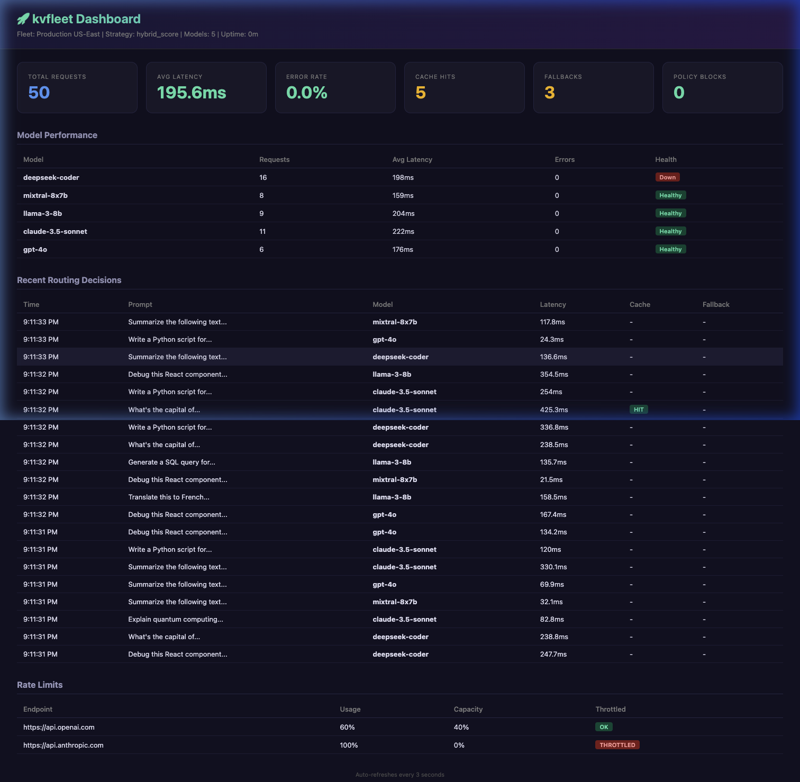

<p align="center">
  <h1 align="center">🚀 kvfleet</h1>
  <p align="center"><strong>Production-grade, KV-cache-aware intelligent routing for self-hosted and hybrid LLM fleets.</strong></p>
  <p align="center">
    <a href="https://pypi.org/project/kvfleet/"></a>
    <a href="https://github.com/adwantg/kvfleet/actions"></a>
    <a href="https://pypi.org/project/kvfleet/"></a>
    <a href="LICENSE"></a>
  </p>
</p>

---

**kvfleet** is the first open-source Python library that unifies **KV-cache state**, **hardware metrics**, and **enterprise policy** into a single routing control plane for self-hosted, hybrid, and multi-provider LLM fleets. No more random load balancing — route every request to the model and replica that will serve it fastest, cheapest, and in compliance with your policies.

## ✨ Key Features

| Feature | Description |
|---------|-------------|
| **🧠 KV-Cache Affinity Routing** | Routes requests to replicas with warm KV-caches via consistent hashing + session affinity |
| **📊 Multi-Objective Scoring** | Weighted scoring across cost, latency, quality, cache affinity, hardware load, and compliance |
| **🔀 14 Routing Strategies** | Static, Weighted, Rules, Cost/Latency/Quality-First, Cheap Cascade, Hybrid Score, Semantic, Domain, Bandit (ε-greedy), UCB1, Thompson Sampling, Exp3 |
| **🔌 6 Adapter Backends** | vLLM, Ollama, TGI, Triton, OpenAI-compatible, Custom HTTP |
| **🛡️ Policy Engine** | PII detection, data classification, data residency, tenant isolation |
| **🏗️ OpenAI-Compatible Gateway** | Drop-in `/v1/chat/completions` proxy — swap one URL, keep your existing code |
| **💡 Explainable Routing** | Every decision produces a structured trace explaining *why* that model was chosen |
| **🔁 Fallback & Retry Chains** | Automatic fallback with timeout escalation and circuit breakers |
| **⚡ Rate Limit Awareness** | Track provider rate limits, auto-route away from throttled endpoints |
| **👁️ Vision/Multimodal Routing** | Detect images/audio/video in requests, route to capable models |
| **💲 Model Cost Sync** | Built-in pricing for 30+ models, auto-sync from config or litellm |
| **📊 Admin Dashboard** | Real-time web UI with fleet stats, routing history, rate limits |
| **👥 Shadow Traffic** | Mirror requests to candidate models for offline comparison |
| **📈 Prometheus Metrics** | Built-in metrics server for routing, fallback, cache, policy, and shadow events |
| **💰 Budget & Quotas** | Per-tenant spending limits with automatic throttling |
| **🔐 Tenant-Aware Routing** | Per-team model preferences, blocked lists, and budget isolation |
| **📝 Semantic Cache** | Hash-based dedup cache for near-duplicate prompts |
| **🔄 Replay Engine** | Replay production traffic against candidate models for offline evaluation |
| **🧰 Capability Filtering** | Auto-exclude models lacking tool-use or JSON mode support |
| **🎯 Per-Request Overrides** | Override strategy, model allowlist, and timeout per request via headers |
| **🏷️ Model Type Classification** | Classify models as `chat`, `embedding`, `rerank` — non-chat excluded from routing |
| **🔗 Shared Connection Pool** | Adapters sharing an endpoint reuse a single HTTP client + health probe dedup |

---

## 📦 Installation

```bash
pip install kvfleet
```

**With extras:**

```bash
# For the OpenAI-compatible gateway server
pip install kvfleet[gateway]

# For semantic similarity routing (requires sentence-transformers)
pip install kvfleet[semantic]

# For development
pip install kvfleet[dev]
```

---

## 🚀 Quickstart

### 1. Create a Fleet Config

```bash
kvfleet init --output fleet.yaml
```

Or create `fleet.yaml` manually:

```yaml
fleet_name: my-fleet
strategy: hybrid_score

models:
  - name: llama-3-8b
    endpoint: http://gpu-1:8000
    provider: vllm
    model_id: meta-llama/Llama-3-8B-Instruct
    quality_score: 0.7
    cost_per_1k_input_tokens: 0.0
    latency_p50_ms: 200
    tags:
      domain: general
      tier: fast

  - name: llama-3-70b
    endpoint: http://gpu-2:8000
    provider: vllm
    model_id: meta-llama/Llama-3-70B-Instruct
    quality_score: 0.9
    cost_per_1k_input_tokens: 0.0
    latency_p50_ms: 800
    tags:
      domain: general
      tier: quality

  - name: gpt-4o-fallback
    endpoint: https://api.openai.com
    provider: openai_compat
    model_id: gpt-4o
    quality_score: 0.95
    cost_per_1k_input_tokens: 0.005
    latency_p50_ms: 400
    allowed_data_classes: [public]
    tags:
      tier: premium

scoring_weights:
  cost: 0.3
  latency: 0.3
  quality: 0.3
  cache_affinity: 0.1

fallback:
  enabled: true
  max_attempts: 3
  fallback_order: [llama-3-8b, llama-3-70b, gpt-4o-fallback]

cache_affinity:
  enabled: true
  session_ttl_seconds: 3600
  prefix_hash_tokens: 128
```

### 2. Route a Request (Python)

```python
import asyncio
from kvfleet import Router
from kvfleet.config.loader import load_config

async def main():
    config = load_config("fleet.yaml")
    router = Router(config)

    response, explanation = await router.route(
        prompt="Explain quantum computing in simple terms",
        data_class="internal",
    )

    print(f"Model: {explanation.selected_model}")
    print(f"Response: {response.content}")
    print(f"\nExplanation:\n{explanation.summary()}")

    await router.close()

asyncio.run(main())
```

### 3. Validate and Inspect (CLI)

```bash
# Validate your config
kvfleet validate fleet.yaml

# Show fleet status
kvfleet fleet fleet.yaml

# Simulate a routing decision
kvfleet simulate fleet.yaml --prompt "Write a Python function"

# Explain routing in JSON
kvfleet explain fleet.yaml --prompt "Hello" --json
```

---

## 📖 Feature Guide with Examples

### 🧠 KV-Cache Affinity Routing

Routes requests to replicas where the KV-cache is likely warm, reducing time-to-first-token by up to 10x for repeated system prompts.

```python
from kvfleet.cache.fingerprints import PromptFingerprinter
from kvfleet.cache.kv_affinity import KVAffinityScorer
from kvfleet.adapters.base import ChatMessage

# Fingerprint a prompt
fingerprinter = PromptFingerprinter(prefix_tokens=128)
messages = [
    ChatMessage(role="system", content="You are a helpful coding assistant."),
    ChatMessage(role="user", content="Write a binary search in Python"),
]
fingerprint = fingerprinter.fingerprint(messages)

# Score cache affinity across endpoints
scorer = KVAffinityScorer(virtual_nodes=150, session_ttl=3600)
scorer.register_endpoints("llama-8b", ["http://gpu-1:8000", "http://gpu-2:8000"])

# After first request, record which endpoint served it
scorer.record_routing(fingerprint, "http://gpu-1:8000")

# Next request with same system prompt → routes to same GPU
best_ep, affinity = scorer.best_endpoint(
    fingerprint, "llama-8b",
    ["http://gpu-1:8000", "http://gpu-2:8000"],
)
print(f"Best endpoint: {best_ep}, affinity: {affinity:.2f}")
# → Best endpoint: http://gpu-1:8000, affinity: 0.50
```

### 📊 Multi-Objective Scoring

Score models across 6 dimensions with configurable weights:

```python
from kvfleet.config.schema import ModelConfig, ScoringWeights
from kvfleet.router.scoring import ScoringEngine, ScoringContext

models = [
    ModelConfig(name="cheap-fast", endpoint="http://a:8000",
                quality_score=0.6, cost_per_1k_input_tokens=0.001, latency_p50_ms=150),
    ModelConfig(name="balanced", endpoint="http://b:8000",
                quality_score=0.8, cost_per_1k_input_tokens=0.01, latency_p50_ms=400),
    ModelConfig(name="premium", endpoint="http://c:8000",
                quality_score=0.95, cost_per_1k_input_tokens=0.05, latency_p50_ms=350),
]

# Weight cost heavily
engine = ScoringEngine(ScoringWeights(cost=0.6, latency=0.2, quality=0.2))
scores = engine.score_candidates(models)
for s in scores:
    print(f"{s.model_name}: {s.total_score:.3f} (cost={s.cost_score:.2f}, quality={s.quality_score:.2f})")
# → cheap-fast: 0.769 (cost=1.00, quality=0.60)
# → balanced:   0.662 (cost=0.99, quality=0.80)
# → premium:    0.530 (cost=0.95, quality=0.95)
```

### 🔀 Routing Strategies

#### Static Routing

```python
from kvfleet.router.strategies import StaticStrategy

strategy = StaticStrategy(default_model="llama-3-70b")
scores = strategy.select(models)
# Always routes to llama-3-70b
```

#### Rules-Based Routing

```python
from kvfleet.config.schema import RouteRuleConfig
from kvfleet.router.strategies import RulesStrategy
from kvfleet.router.scoring import ScoringContext

rules = [
    RouteRuleConfig(name="coding", condition={"tags.domain": "coding"}, target_model="deepseek", priority=1),
    RouteRuleConfig(name="medical", condition={"tags.domain": "medical"}, target_model="med-llama", priority=1),
]
strategy = RulesStrategy(rules=rules)
scores = strategy.select(models, ScoringContext(tags={"domain": "coding"}))
```

#### Cost-First / Latency-First / Quality-First

```python
from kvfleet.router.strategies import CostFirstStrategy, LatencyFirstStrategy, QualityFirstStrategy

# Cheapest model wins
scores = CostFirstStrategy().select(models)

# Fastest model wins
scores = LatencyFirstStrategy().select(models)

# Highest quality wins
scores = QualityFirstStrategy().select(models)
```

#### Cheap Cascade

```python
from kvfleet.router.strategies import CheapCascadeStrategy

# Try cheapest first, escalate on failure
strategy = CheapCascadeStrategy()
scores = strategy.select(models)
# Order: cheap-fast → balanced → premium
```

#### Semantic Routing (Content-Aware)

Automatically classifies prompts by domain (coding, math, creative, medical, legal, scientific, translation, summarization) and routes to the best-matching model:

```python
from kvfleet.router.semantic import SemanticStrategy, classify_domain

# Built-in domain classifier (works without ML dependencies)
domain, confidence = classify_domain("Write a Python function to sort a list")
print(f"Domain: {domain}, confidence: {confidence:.2f}")
# → Domain: coding, confidence: 0.70

# Route by content
strategy = SemanticStrategy()
scores = strategy.select(models, ScoringContext(
    metadata={"prompt_text": "Solve this integral from 0 to pi"}
))
# → Routes to math-specialized model

# With optional embedding support (requires sentence-transformers)
strategy = SemanticStrategy(
    model_descriptions={"code-model": "Expert at coding tasks"},
    use_embeddings=True,  # pip install sentence-transformers
)
```

#### Domain Mapping

```python
from kvfleet.router.semantic import DomainStrategy

# Explicit domain → model mapping
strategy = DomainStrategy(domain_model_map={
    "coding": "deepseek-coder",
    "medical": "med-llama",
    "creative": "llama-3-70b",
})
# Coding prompt → deepseek-coder, medical → med-llama
```

#### Bandit Strategies (Adaptive/Learned Routing)

Four online learning strategies that automatically discover the best model through exploration and exploitation:

```python
from kvfleet.router.learned import (
    EpsilonGreedyStrategy,  # Simple explore/exploit
    UCB1Strategy,           # Upper Confidence Bound
    ThompsonSamplingStrategy,  # Bayesian sampling
    Exp3Strategy,           # Adversarial setting
    compute_reward,         # Reward from outcomes
)

# Epsilon-greedy: explores 10% of time, exploits 90%
strategy = EpsilonGreedyStrategy(epsilon=0.1, decay=0.999)
scores = strategy.select(models)
selected = next(s for s in scores if s.selected)

# After each request, update with observed reward
reward = compute_reward(
    latency_ms=350, quality_score=0.85, cost=0.001, success=True
)
strategy.update(selected.model_name, reward)
# Strategy automatically converges to best model over time

# UCB1: Mathematically optimal exploration-exploitation
strategy = UCB1Strategy(exploration_constant=1.41)

# Thompson Sampling: Bayesian approach, excellent convergence
strategy = ThompsonSamplingStrategy()

# Exp3: Works in adversarial/non-stationary environments
strategy = Exp3Strategy(gamma=0.1)
```

### 🔌 Adapter Backends

#### vLLM (with KV-cache metrics)

```python
from kvfleet.adapters.vllm import VLLMAdapter
from kvfleet.adapters.base import ChatMessage, ChatRequest

adapter = VLLMAdapter(endpoint="http://gpu-1:8000", model_id="meta-llama/Llama-3-8B")

# Chat
response = await adapter.chat(ChatRequest(
    messages=[ChatMessage(role="user", content="Hello!")],
))
print(response.content)

# Get KV-cache state
cache_state = await adapter.get_cache_state()
print(f"KV cache usage: {cache_state.get('kv_cache_usage_pct', 0)}%")

# Health check with GPU metrics
health = await adapter.health_check()
print(f"Healthy: {health.healthy}, Queue: {health.queue_depth}")
```

#### Ollama

```python
from kvfleet.adapters.ollama import OllamaAdapter

adapter = OllamaAdapter(endpoint="http://localhost:11434", model_id="llama3")
response = await adapter.chat(ChatRequest(
    messages=[ChatMessage(role="user", content="What is Rust?")],
))
```

#### TGI (HuggingFace Text Generation Inference)

```python
from kvfleet.adapters.tgi import TGIAdapter

adapter = TGIAdapter(endpoint="http://tgi-server:8080", model_id="mistral-7b")
response = await adapter.chat(ChatRequest(
    messages=[ChatMessage(role="user", content="Summarize this article...")],
))
```

#### Triton Inference Server

```python
from kvfleet.adapters.triton import TritonAdapter

adapter = TritonAdapter(endpoint="http://triton:8000", model_id="llama-3-70b")
health = await adapter.health_check()  # Uses /v2/health/ready
```

#### Custom HTTP

```python
from kvfleet.adapters.custom_http import CustomHTTPAdapter

adapter = CustomHTTPAdapter(
    endpoint="http://internal-api:5000",
    model_id="proprietary-model",
    chat_path="/api/generate",
    health_path="/api/status",
    response_content_key="output",
    headers={"X-API-Key": "secret"},
)
```

### 🛡️ Policy Engine

#### PII Detection → Route to Private Models

```python
from kvfleet.policy.pii import PIIDetector

detector = PIIDetector()

# Detect PII
result = detector.detect("Email me at user@example.com, SSN: 123-45-6789")
print(f"Has PII: {result.has_pii}")
print(f"Types: {result.pii_types}")
# → Has PII: True
# → Types: ['email', 'ssn']

# Redact PII
redacted = detector.redact("Call (555) 123-4567 for info")
print(redacted.redacted_text)
# → Call [REDACTED](phone_us) for info
```

#### Data Classification Policy

```yaml
# In fleet.yaml
policy:
  enabled: true
  pii_detection: true
  default_data_class: internal
  rules:
    - name: confidential-to-local
      condition: "data_class == confidential"
      action: require_model
      target_models: [llama-3-local]
      priority: 1
```

```python
from kvfleet.policy.engine import PolicyEngine, PolicyContext
from kvfleet.config.schema import PolicyConfig, PolicyRule

engine = PolicyEngine(PolicyConfig(
    enabled=True,
    pii_detection=True,
    rules=[
        PolicyRule(
            name="pii-to-private",
            condition="has_pii == true",
            action="require_private",
        ),
    ],
))

# Evaluate — PII triggers private-only routing
filtered, decisions = engine.evaluate(
    candidates=all_models,
    context=PolicyContext(has_pii=True),
)
for d in decisions:
    print(f"[{d.rule_name}] {'PASS' if d.passed else 'BLOCK'}: {d.reason}")
```

#### Data Residency

```python
from kvfleet.policy.residency import ResidencyEngine, ResidencyRule

engine = ResidencyEngine(rules=[
    ResidencyRule(
        name="eu-data-stays-in-eu",
        source_regions=["eu-west-1", "eu-central-1"],
        allowed_model_regions=["eu-west-1", "eu-central-1"],
        blocked_providers=["openai_compat", "bedrock"],
    ),
])

assert engine.is_compliant("eu-west-1", "eu-west-1", "vllm")      # ✓
assert not engine.is_compliant("eu-west-1", "us-east-1", "vllm")  # ✗ Wrong region
```

### 💰 Tenant-Aware Routing & Budgets

```yaml
# In fleet.yaml
tenants:
  team-ml:
    name: ML Team
    preferred_models: [llama-3-70b, deepseek-coder]
    blocked_models: [gpt-4o-fallback]
    budget:
      enabled: true
      monthly_budget_usd: 500.0
      alert_threshold_pct: 80.0

  team-support:
    name: Support Team
    preferred_models: [llama-3-8b]
    allowed_data_classes: [public, internal]
    budget:
      enabled: true
      monthly_budget_usd: 100.0
```

```python
from kvfleet.policy.tenant import TenantManager
from kvfleet.config.schema import TenantConfig, BudgetConfig

manager = TenantManager(tenants={
    "team-ml": TenantConfig(
        name="ML Team",
        preferred_models=["llama-70b"],
        budget=BudgetConfig(enabled=True, monthly_budget_usd=500),
    ),
})

# Filter models for tenant
allowed = manager.filter_models_for_tenant("team-ml", ["llama-8b", "llama-70b", "gpt-4o"])
# → ["llama-70b"]

# Track spending
manager.record_request("team-ml", 0.05)
assert manager.check_budget("team-ml", 0.01)  # Under budget → True
```

### 💡 Explainable Routing

Every routing decision produces a full trace:

```python
config = load_config("fleet.yaml")
router = Router(config)

response, explanation = await router.route(prompt="Write a haiku about Python")

# Human-readable summary
print(explanation.summary())
# Strategy: hybrid_score
# Selected: llama-3-8b
# Cache affinity: MISS
# Candidate scores:
#   ✓ llama-3-8b: 0.750 
#   ✗ llama-3-70b: 0.620
#   ✗ gpt-4o: 0.480 (rejected: Lower score)

# Machine-readable JSON
import json
print(json.dumps(explanation.to_dict(), indent=2))
```

### 🔁 Fallback & Retry Chains

```yaml
fallback:
  enabled: true
  max_attempts: 3
  timeout_ms: 10000
  promote_on_timeout: true
  fallback_order: [llama-3-8b, llama-3-70b, gpt-4o-fallback]
```

```python
from kvfleet.router.fallback import FallbackChain, EscalationChain
from kvfleet.config.schema import FallbackConfig

# Automatic fallback on failure
chain = FallbackChain(FallbackConfig(
    enabled=True,
    max_attempts=3,
    timeout_ms=5000,
    fallback_order=["fast-model", "strong-model", "cloud-fallback"],
))

# Confidence-based escalation
escalation = EscalationChain(
    chain=["llama-8b", "llama-70b", "gpt-4o"],
    confidence_threshold=0.7,
)
response, used_model = await escalation.execute_with_escalation(
    adapters=adapters,
    request=request,
)
```

### 👥 Shadow Traffic

```yaml
shadow:
  enabled: true
  shadow_models: [candidate-model-v2, experimental-model]
  sample_rate: 0.1  # 10% of traffic
  log_outputs: true
```

```python
from kvfleet.eval.shadow import ShadowTrafficManager

shadow = ShadowTrafficManager(
    sample_rate=0.1,
    shadow_models=["new-model-v2"],
    enabled=True,
)

# Automatically mirrors traffic (non-blocking)
if shadow.should_shadow():
    comparison = await shadow.execute_shadow(
        request=request,
        primary_model="llama-8b",
        primary_response=response,
        adapters=adapters,
    )
    for result in comparison.shadow_results:
        print(f"{result.model}: {result.latency_ms:.0f}ms")
```

### 🔄 Model Comparison & Replay

```python
from kvfleet.eval.compare import ModelComparator, ReplayEngine

# Compare models side-by-side
comparator = ModelComparator()
result = await comparator.compare(request, adapters, ["llama-8b", "llama-70b", "gpt-4o"])
for model, resp in result.results.items():
    print(f"{model}: {result.latencies[model]:.0f}ms — {resp.content[:50]}...")

# Record and replay production traffic
replay = ReplayEngine()
replay.record(request, "llama-8b", response)

# Later: replay against new models
results = await replay.replay(adapters, model_names=["new-model-v2"])
```

### 📈 Prometheus Metrics

```python
from kvfleet.telemetry.metrics import MetricsExporter

metrics = MetricsExporter(port=9090, enabled=True)
metrics.start_server()  # → http://localhost:9090/metrics

# Auto-recorded by Router:
# kvfleet_route_requests_total{strategy="hybrid_score", status="success"}
# kvfleet_route_latency_seconds{strategy="hybrid_score"}
# kvfleet_model_selected_total{model="llama-3-8b"}
# kvfleet_fallback_triggered_total{from_model="llama-8b", to_model="llama-70b"}
# kvfleet_cache_affinity_hits_total{type="session"}
# kvfleet_policy_blocks_total{rule="pii_detection"}
# kvfleet_model_health{model="llama-8b", endpoint="http://gpu-1:8000"}
```

### 🏗️ OpenAI-Compatible Gateway

```bash
# Start gateway (drop-in replacement for OpenAI API)
kvfleet serve fleet.yaml --port 8000

# Now use any OpenAI client — kvfleet handles routing transparently
curl http://localhost:8000/v1/chat/completions \
  -H "Content-Type: application/json" \
  -d '{
    "model": "auto",
    "messages": [{"role": "user", "content": "Hello!"}]
  }'

# Simulate without executing
curl http://localhost:8000/v1/route/explain \
  -H "Content-Type: application/json" \
  -d '{"messages": [{"role": "user", "content": "Hello"}]}'

# Health check
curl http://localhost:8000/health
```

```python
# Works with OpenAI Python SDK
from openai import OpenAI

client = OpenAI(base_url="http://localhost:8000/v1", api_key="optional")
response = client.chat.completions.create(
    model="auto",  # kvfleet selects the best model
    messages=[{"role": "user", "content": "What is Python?"}],
)
```

### 🎯 Gateway Enhancements (v0.10)

The gateway supports per-request overrides, capability-aware routing, and request tracing — all configurable via `fleet.yaml`.

#### Header Pass-Through (E-1)

Forward arbitrary HTTP headers from clients through to backend models:

```yaml
# fleet.yaml
gateway:
  passthrough_headers:
    - X-Access-Token
    - X-Correlation-ID
    - X-Trace-Parent
```

```bash
# Client sends headers → they reach the backend automatically
curl http://localhost:8000/v1/chat/completions \
  -H "X-Access-Token: tok_abc123" \
  -H "X-Correlation-ID: req-789" \
  -H "Content-Type: application/json" \
  -d '{"messages": [{"role": "user", "content": "Hello"}]}'
```

#### Tool-Use & JSON Mode Capability Filtering (E-2, E-8)

Requests with `tools` or `response_format: {type: json_object}` are automatically routed only to models that support those features:

```yaml
models:
  - name: gpt-4o
    capabilities:
      supports_tools: true
      supports_json_mode: true
  - name: llama-3-8b
    capabilities:
      supports_tools: false
      supports_json_mode: false
```

```python
# This request will only be routed to gpt-4o (has tool support)
response = client.chat.completions.create(
    model="auto",
    messages=[{"role": "user", "content": "What's the weather?"}],
    tools=[{
        "type": "function",
        "function": {"name": "get_weather", "parameters": {}}
    }],
)

# This request will only go to JSON-capable models
response = client.chat.completions.create(
    model="auto",
    messages=[{"role": "user", "content": "List 3 colors as JSON"}],
    response_format={"type": "json_object"},
)
```

#### Per-Request Strategy Override (E-3)

Override the fleet-wide routing strategy on a per-request basis:

```yaml
gateway:
  strategy_header: X-KVFleet-Strategy  # default
```

```bash
# Force cost-first for this request, even if fleet uses hybrid_score
curl http://localhost:8000/v1/chat/completions \
  -H "X-KVFleet-Strategy: cost_first" \
  -H "Content-Type: application/json" \
  -d '{"messages": [{"role": "user", "content": "Quick test"}]}'
```

Supported values: `cost_first`, `latency_first`, `quality_first`, `hybrid_score`, `cheap_cascade`, `round_robin`, `weighted`, `random`, `semantic`, `domain`, `epsilon_greedy`, `ucb1`, `thompson_sampling`, `exp3`

#### Per-Request Model Allowlist (E-4)

Restrict which models can serve a specific request:

```bash
# Only consider these two models for this request
curl http://localhost:8000/v1/chat/completions \
  -H "X-KVFleet-Models: llama-3-70b, gpt-4o" \
  -H "Content-Type: application/json" \
  -d '{"messages": [{"role": "user", "content": "Important task"}]}'
```

#### Tenant ID from Header (E-5)

Extract tenant identity from a configurable header for per-tenant routing and budget enforcement:

```yaml
gateway:
  tenant_header: X-Tenant-ID
```

```bash
curl http://localhost:8000/v1/chat/completions \
  -H "X-Tenant-ID: team-ml" \
  -H "Content-Type: application/json" \
  -d '{"messages": [{"role": "user", "content": "Hello"}]}'
# → Routes according to team-ml's model preferences and budget
```

#### Model Type Classification (E-6)

Classify models as `chat`, `embedding`, `completion`, or `rerank`. Non-chat models are automatically excluded from `/v1/chat/completions` routing:

```yaml
models:
  - name: gpt-4o
    capabilities:
      model_type: chat  # default
  - name: text-embedding-3
    capabilities:
      model_type: embedding  # excluded from chat routing
  - name: reranker-v2
    capabilities:
      model_type: rerank  # excluded from chat routing
```

```python
# Programmatic filtering
from kvfleet.registry.models import ModelRegistry

reg = ModelRegistry()
chat_models = reg.list_models(model_type="chat")       # Only chat models
embeddings = reg.list_models(model_type="embedding")    # Only embedding models
```

#### Per-Request Timeout Override (E-9)

Override the default timeout per request:

```bash
# Allow 30 seconds for this complex request (value in milliseconds)
curl http://localhost:8000/v1/chat/completions \
  -H "X-KVFleet-Timeout: 30000" \
  -H "Content-Type: application/json" \
  -d '{"messages": [{"role": "user", "content": "Write a detailed essay..."}]}'
```

#### Request ID Propagation (E-10)

Send `X-Request-ID` to trace requests end-to-end. If not provided, one is generated automatically:

```bash
curl -v http://localhost:8000/v1/chat/completions \
  -H "X-Request-ID: my-trace-001" \
  -H "Content-Type: application/json" \
  -d '{"messages": [{"role": "user", "content": "Hello"}]}'
# Response headers include:
#   X-Request-ID: my-trace-001
# Response body includes:
#   {"id": "my-trace-001", ...}
```

#### Shared Connection Pooling (E-7)

Adapters that share the same endpoint and API key automatically reuse a single HTTP connection pool, reducing memory and connection overhead. Health probes are also deduplicated with a 5-second TTL to avoid redundant checks.

```yaml
# These two models share an endpoint → one connection pool
models:
  - name: llama-3-8b
    endpoint: http://gpu-cluster:8000
    provider: openai_compat
    model_id: meta-llama/Llama-3-8B
  - name: llama-3-70b
    endpoint: http://gpu-cluster:8000  # Same endpoint!
    provider: openai_compat
    model_id: meta-llama/Llama-3-70B
```

### 🖥️ Health Monitoring & Circuit Breakers

```python
from kvfleet.telemetry.health import HealthManager
from kvfleet.adapters.base import EndpointHealth

health_mgr = HealthManager(
    failure_threshold=3,        # Open circuit after 3 failures
    recovery_timeout_seconds=60, # Try again after 60s
)

# Automatic circuit breaking
health_mgr.update_health(EndpointHealth(endpoint="http://gpu-1:8000", healthy=False))
health_mgr.update_health(EndpointHealth(endpoint="http://gpu-1:8000", healthy=False))
health_mgr.update_health(EndpointHealth(endpoint="http://gpu-1:8000", healthy=False))
# → Circuit breaker OPEN — endpoint removed from routing

# Warm model detection
if health_mgr.is_warm("http://gpu-1:8000"):
    print("GPU is warm — prioritize for low latency")
```

### 📝 Semantic Dedup Cache

```python
from kvfleet.cache.semantic_cache import SemanticCache
from kvfleet.cache.fingerprints import PromptFingerprinter

cache = SemanticCache(max_size=10000, ttl_seconds=3600)
fingerprinter = PromptFingerprinter()

# Check cache before routing
fp = fingerprinter.fingerprint(messages)
cached = cache.get(fp)
if cached:
    print(f"Cache hit! Saved a call to {cached.model}")
    return cached.content

# After getting response, cache it
cache.put(fp, response.content, selected_model)
```

### 🔧 SDK: Async and Sync Clients

```python
# Async (recommended for production)
from kvfleet.sdk.async_client import AsyncFleetClient

async with AsyncFleetClient.from_yaml("fleet.yaml") as client:
    response = await client.chat("Explain recursion")
    print(response.content)

    # With explanation
    response, explanation = await client.chat_with_explanation("Hello")

    # Simulate without calling backends
    explanation = await client.simulate("Test prompt")

# Sync (for scripts, notebooks)
from kvfleet.sdk.sync_client import SyncFleetClient

with SyncFleetClient.from_yaml("fleet.yaml") as client:
    response = client.chat("What is Python?")
    print(response.content)
```

### ⚡ Rate Limit Awareness

Track provider rate limits and automatically route away from throttled endpoints:

```python
from kvfleet.telemetry.rate_limits import RateLimitTracker

tracker = RateLimitTracker(default_rpm=60, throttle_threshold=0.85)

# Record each request
tracker.record_request("http://api:8000", model_id="llama-3-8b", tokens_used=500)

# Parse rate limit headers from provider responses
tracker.record_rate_limit_headers("http://api:8000", "llama-3-8b", headers={
    "x-ratelimit-limit-requests": "60",
    "x-ratelimit-remaining-requests": "12",
})

# Handle 429 responses with cooldown
tracker.record_429("http://api:8000", "llama-3-8b", retry_after=30)

# Check before routing
if tracker.should_throttle("http://api:8000", "llama-3-8b"):
    print("Endpoint throttled — route to alternative")

# Use as scoring signal
capacity = tracker.get_capacity_score("http://api:8000", "llama-3-8b")  # 0.0–1.0
print(f"Available capacity: {capacity:.0%}")
```

### 👁️ Vision & Multimodal Routing

Automatically detect images/audio/video in requests and route to capable models:

```python
from kvfleet.router.multimodal import detect_modality, filter_vision_capable

# OpenAI vision format
messages = [
    {"role": "user", "content": [
        {"type": "text", "text": "What's in this image?"},
        {"type": "image_url", "image_url": {"url": "https://example.com/photo.jpg"}},
    ]},
]

# Detect modalities
detection = detect_modality(messages)
print(f"Multimodal: {detection.is_multimodal}")     # True
print(f"Modality: {detection.primary_modality}")     # "vision"
print(f"Images: {detection.image_count}")             # 1
print(f"Est. image tokens: {detection.estimated_image_tokens}")  # 765

# Filter to vision-capable models only
capable = filter_vision_capable(all_models, detection)
# → Only models with capabilities.supports_vision=True or tags.vision="true"
```

Tag your vision models:

```yaml
models:
  - name: gpt-4o
    capabilities:
      supports_vision: true
  - name: llama-3-8b
    capabilities:
      supports_vision: false
```

### 💲 Model Cost Sync

Built-in pricing for 30+ models with automatic sync:

```python
from kvfleet.telemetry.cost_sync import CostSyncManager

cost_mgr = CostSyncManager()  # Loads 30+ built-in prices

# Look up costs
cost = cost_mgr.get_cost("gpt-4o")
print(f"Input: ${cost.input_cost_per_1k}/1K tokens")
print(f"Output: ${cost.output_cost_per_1k}/1K tokens")

# Estimate request cost
est = cost_mgr.estimate_request_cost("gpt-4o", input_tokens=1000, output_tokens=500)
print(f"Estimated cost: ${est:.4f}")

# Find cheapest model
cheapest = cost_mgr.get_cheapest_model(["gpt-4o", "gpt-4o-mini", "gpt-4"])
print(f"Cheapest: {cheapest}")  # → gpt-4o-mini

# Sync from your fleet config
cost_mgr.sync_from_config(fleet_config.models)

# Sync from litellm (if installed)
cost_mgr.sync_from_litellm()

# Set custom pricing
cost_mgr.set_cost("my-private-model", input_cost=0.001, output_cost=0.002)
```

Built-in pricing includes: GPT-4o, GPT-4o-mini, GPT-4, Claude 3.5/3, Gemini 2.0/1.5, Llama 3, Mistral, DeepSeek, Groq-hosted, Together AI, and more.

### 📊 Admin Dashboard

Real-time web UI with zero external dependencies:



```python
from kvfleet.gateway.dashboard import DashboardState, start_dashboard

# Initialize state
state = DashboardState()
state.fleet_name = "my-fleet"
state.strategy = "semantic"
state.model_count = 5

# Start dashboard (background thread)
server = start_dashboard(state, host="0.0.0.0", port=8501)
# → Admin dashboard running at http://localhost:8501

# Record routing events (happens automatically in Router)
state.record_route(
    prompt_preview="Write a Python class...",
    selected_model="deepseek-coder",
    strategy="semantic",
    latency_ms=350.0,
    scores={"deepseek-coder": 0.85, "llama-70b": 0.62},
)

# Update health, rate limits, budgets
state.update_health("llama-8b", "http://gpu-1:8000", healthy=True, latency_ms=50)
```

Dashboard shows:
- **Fleet overview** — strategy, model count, uptime
- **Live counters** — requests, errors, cache hits, fallbacks, policy blocks
- **Model performance** — per-model request counts, avg latency, health status
- **Routing history** — last 20 decisions with prompt, model, latency, cache/fallback
- **Rate limits** — per-endpoint usage, capacity, throttle status

Auto-refreshes every 3 seconds. Access JSON API at `GET /api/state`.

---

## 🖥️ CLI Commands

| Command | Description |
|---------|-------------|
| `kvfleet init` | Generate a sample `fleet.yaml` |
| `kvfleet validate <config>` | Validate config syntax |
| `kvfleet fleet <config>` | Show fleet status table |
| `kvfleet simulate <config>` | Simulate routing without backends |
| `kvfleet explain <config>` | Detailed routing explanation |
| `kvfleet health <config>` | Health check all endpoints |
| `kvfleet serve <config>` | Start OpenAI-compatible gateway |

---

## 🏛️ Architecture

```
┌──────────────────────────────────────────────────┐
│                  kvfleet Router                   │
├────────┬─────────┬──────────┬───────────┬────────┤
│ Config │Registry │ Strategy │  Scoring  │Explain │
│ Loader │         │ Engine   │  Engine   │  Trace │
├────────┴─────────┴──────────┴───────────┴────────┤
│              KV-Cache Affinity Layer              │
│  ┌────────────┐ ┌──────────┐ ┌────────────────┐  │
│  │Fingerprint │ │ Consist. │ │  Session Store  │  │
│  │   Engine   │ │Hash Ring │ │  (TTL-based)    │  │
│  └────────────┘ └──────────┘ └────────────────┘  │
├──────────────────────────────────────────────────┤
│                  Policy Engine                    │
│  ┌─────┐ ┌────────────┐ ┌─────────┐ ┌────────┐  │
│  │ PII │ │Data Class  │ │Residency│ │ Tenant │  │
│  │Scan │ │  Filter    │ │  Rules  │ │Manager │  │
│  └─────┘ └────────────┘ └─────────┘ └────────┘  │
├──────────────────────────────────────────────────┤
│                   Adapters                        │
│  ┌─────┐ ┌──────┐ ┌─────┐ ┌──────┐ ┌────────┐   │
│  │vLLM │ │Ollama│ │ TGI │ │Triton│ │CustomHT│   │
│  └─────┘ └──────┘ └─────┘ └──────┘ └────────┘   │
├──────────────────────────────────────────────────┤
│              Telemetry & Eval                     │
│  ┌──────────┐ ┌────────┐ ┌────────┐ ┌─────────┐  │
│  │Prometheus│ │ Health │ │ Shadow │ │ Replay  │  │
│  │ Metrics  │ │Manager │ │Traffic │ │ Engine  │  │
│  └──────────┘ └────────┘ └────────┘ └─────────┘  │
└──────────────────────────────────────────────────┘
```

---

## 📋 Environment Variable Overrides

Override any config value via environment variables:

```bash
export KVFLEET__STRATEGY=cost_first
export KVFLEET__FLEET_NAME=production
export KVFLEET__CACHE_AFFINITY__ENABLED=true
export KVFLEET__TELEMETRY__PROMETHEUS_PORT=9091

# Or use KVFLEET_CONFIG to set the default config path
export KVFLEET_CONFIG=/etc/kvfleet/fleet.yaml
```

---

## 🧪 Testing

```bash
# Run all tests
python -m pytest tests/ -v

# Run with coverage
python -m pytest tests/ --cov=kvfleet --cov-report=term-missing

# Run specific test file
python -m pytest tests/unit/test_router.py -v
```

---

## 📊 Comparison with Alternatives

| Feature | kvfleet | LiteLLM | RouteLLM | semantic-router |
|---------|---------|---------|----------|-----------------|
| KV-cache affinity | ✅ | ❌ | ❌ | ❌ |
| GPU-aware routing | ✅ | ❌ | ❌ | ❌ |
| Multi-objective scoring | ✅ | ❌ | ✅ | ❌ |
| Policy engine (PII/compliance) | ✅ | ❌ | ❌ | ❌ |
| Explainable decisions | ✅ | ❌ | ❌ | ❌ |
| Self-hosted focus | ✅ | ❌ | ✅ | ❌ |
| Shadow traffic | ✅ | ❌ | ❌ | ❌ |
| Tenant isolation | ✅ | ❌ | ❌ | ❌ |
| OpenAI-compat gateway | ✅ | ✅ | ❌ | ❌ |

---

## ⚠️ Remaining Constraints

> See [CONSTRAINTS.md](CONSTRAINTS.md) for the full list.

| Constraint | Description | Status |
|------------|-------------|--------|
| **Gateway** | Requires `starlette` + `uvicorn` | Install `kvfleet[gateway]` |
| **PII detection** | Pattern-based (regex), not NER-based | Integrate dedicated PII service for high-sensitivity use |
| **KV-cache metrics** | Only vLLM exposes `/metrics` with cache stats | Use health checks as proxy signals for other backends |
| **Gateway auth** | Simple bearer token only | Place behind nginx/envoy for mTLS/OAuth |

✅ **Resolved**: Semantic routing (8-domain classifier + embeddings), bandit strategies (4 algorithms), thread-safe stores, Custom HTTP streaming (SSE)

---

## 📋 Changelog

### v0.11.0 — Adapter Hardening & Gateway Stability

**Bug Fixes & Security:**
* **BUG-1:** Fixed `CustomHTTPAdapter` configuration by adding `custom_headers`, `custom_chat_path`, `custom_health_path`, and `custom_request_template` to `ModelConfig` schema.
* **BUG-2:** Fixed silent dropping of `tool_calls` in gateway responses; `ChatResponse` now properly serializes them to OpenAI-compatible format.
* **BUG-3:** Added `api_key` support across *all* adapters (TGI, Triton, Ollama, CustomHTTP, plus base InferenceAdapter) to allow sending `Authorization: Bearer <key>` headers securely.
* **BUG-4:** Fixed gateway discarding `stop` sequences from incoming chat completions requests.
* **BUG-5:** Enhanced security in `save_config()` to prevent plaintext leaks of `api_key` to YAML files.
* **BUG-6:** Fixed gateway omitting `name`, `tool_call_id`, and `tool_calls` when building `ChatMessage` objects from incoming requests.

**Improvements:**
* **IMPROVE-1:** Isolated Prometheus `CollectorRegistry` in `MetricsExporter` to prevent timeseries pollution across instances or test runs.

### v0.10.0 — Gateway Enhancements

**New Features:**

| ID | Enhancement | Priority |
|---|---|---|
| E-1 | **Header pass-through** — forward arbitrary HTTP headers from client to backend | P0 |
| E-2 | **Tool-use capability filter** — auto-exclude models without `supports_tools` | P0 |
| E-3 | **Per-request strategy override** — `X-KVFleet-Strategy` header | P1 |
| E-4 | **Per-request model allowlist** — `X-KVFleet-Models` header | P1 |
| E-5 | **Tenant ID from header** — configurable `tenant_header` | P1 |
| E-6 | **Model type classification** — `chat`/`embedding`/`rerank` with auto-filtering | P2 |
| E-7 | **Shared connection pool** — class-level HTTP client reuse + health probe dedup | P2 |
| E-8 | **JSON mode capability filter** — auto-exclude non-`supports_json_mode` models | P0 |
| E-9 | **Per-request timeout override** — `X-KVFleet-Timeout` header (ms) | P1 |
| E-10 | **Request ID propagation** — `X-Request-ID` forwarded/generated in responses | P1 |

**Files changed:** `schema.py`, `server.py`, `openai_compat.py`, `multimodal.py`, `engine.py`, `explain.py`, `fallback.py`, `models.py`, `collector.py`

**Tests:** 33 new tests (225 total), all passing

### v0.9.0 — Initial Release

- 14 routing strategies (static, weighted, rules, cost/latency/quality-first, cheap cascade, hybrid score, semantic, domain, ε-greedy, UCB1, Thompson sampling, Exp3)
- 6 adapter backends (vLLM, Ollama, TGI, Triton, OpenAI-compatible, Custom HTTP)
- KV-cache affinity routing with consistent hashing
- Multi-objective scoring across cost, latency, quality, cache, hardware, compliance
- Policy engine with PII detection, data classification, data residency, tenant isolation
- OpenAI-compatible gateway with admin dashboard
- Fallback & retry chains with circuit breakers
- Shadow traffic, replay engine, Prometheus metrics
- Rate limit awareness with auto-throttling
- Vision/multimodal routing
- Model cost sync with 30+ built-in prices
- Semantic dedup cache
- Budget & quotas per tenant
- SDK (async + sync clients) and CLI

---

## 🗺️ Roadmap

- **v0.10.0** (current): Gateway enhancements — capability filtering, per-request overrides, model type classification, connection pooling
- **v1.0**: Canary rollouts, SLO-aware routing, A/B testing framework
- **v2.0**: Generative semantic cache, auto-escalation, model fine-tuning integration

---

## 📄 License

MIT — see [LICENSE](LICENSE) for details.

## 👤 Author

**Goutam Adwant** — [@adwantg](https://github.com/adwantg)
